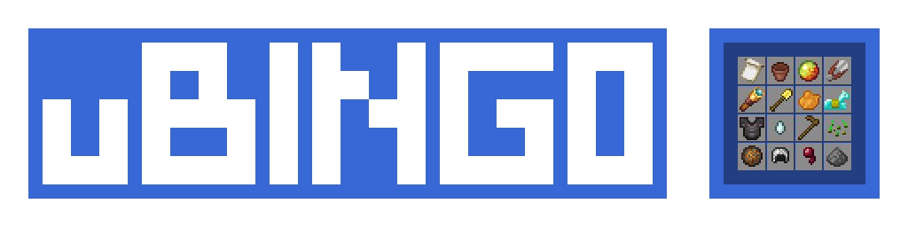

<div id="top"></div>

[![Issues][issues-shield]][issues-url]
[![Workflow][workflow-shield]][workflow-url]
[![MIT License][license-shield]][license-url]
[![Discord][discord-shield]][discord-url]
[![PAX][pax-shield]][pax-url]


<!-- PROJECT LOGO -->
<br />
<div align="center">
    

<h3 align="center">uBingo</h3>

  <p align="center">
    A Bingo Modpack based on the Bongo mod with much features.
    <br />
    <a href="https://docs.unately.com/"><strong>Explore the docs »</strong></a>
    <br />
    <br />
    <a href="https://github.com/Unately/uBingo/actions/workflows/devbuild.yml?query=is%3Asuccess">Development Builds</a>
    ·
    <a href="https://github.com/Unately/uBingo/releases/latest">Download</a>
    ·
    <a href="https://github.com/Unately/uBingo/issues">Request Feature</a>
  </p>
</div>


<!-- TABLE OF CONTENTS -->
<details>
  <summary>Table of Contents</summary>
  <ol>
    <li>
      <a href="#about-the-project">About The Project</a>
      <ul>
        <li><a href="#built-with">Built With</a></li>
      </ul>
    </li>
    <li>
      <a href="#getting-started">Getting Started</a>
      <ul>
        <li><a href="#installation">Installation</a></li>
      </ul>
    </li>
    <li><a href="#usage">Usage</a></li>
    <li><a href="#roadmap">Roadmap</a></li>
    <li><a href="#contributing">Contributing</a></li>
    <li><a href="#license">License</a></li>
    <li><a href="#contact">Contact</a></li>
    <li><a href="#acknowledgments">Acknowledgments</a></li>
  </ol>
</details>


<!-- ABOUT THE PROJECT -->
## About The Project

[![Screenshot][product-screenshot]](https://cdn.jqshuv.xyz/screenshot.png)

This is a modpack to play bingo with your friends or alone. It's based on the [Bongo Mod][bongo-link] by noeppinoeppi and the modpack manager [PAX][pax-link] by froehlichA. It contains some extra mods to improve the gameplay and run it more smooth.


### Built With

* [PAX](https://github.com/froehlichA/pax/)
* [Forge](https://forums.minecraftforge.net/)
* [GDLauncher](https://gdevs.io/)


<!-- GETTING STARTED -->
## Getting Started

This is an example of how you may give instructions on setting up your project locally.
To get a local copy up and running follow these simple example steps.


### Installation

> https://docs.jqshuv.xyz
<!-- #### Using GDLauncher (Recommended) -->


<!-- USAGE EXAMPLES -->
## Usage

_Please refer to the [PAX Documentation](https://github.com/froehlichA/pax/wiki)_


<!-- ## Visual Studio Code Features -->


<!-- ROADMAP -->
## Roadmap

[![Project][project-shield]][project-url]

See the [open issues](https://github.com/unately/ubingo/issues) for a full list of proposed features (and known issues).


<!-- CONTRIBUTING -->
## Contributing

Contributions are what make the open source community such an amazing place to learn, inspire, and create. Any contributions you make are **greatly appreciated**.

If you have a suggestion that would make this better, please fork the repo and create a pull request. You can also simply open an issue with the tag "enhancement".
Don't forget to give the project a star! Thanks again!

1. Fork the Project
2. Create your Feature Branch (`git checkout -b feature/AmazingFeature`)
3. Commit your Changes (`git commit -m 'Add some AmazingFeature'`)
4. Push to the Branch (`git push origin feature/AmazingFeature`)
5. Open a Pull Request


<!-- LICENSE -->
## License

Distributed under the MIT License. See the [`LICENSE`](https://github.com/Unately/uBingo/blob/master/LICENSE.txt) for more information.


<!-- CONTACT -->
## Contact

Joshua Schmitt - [@jqshuv](https://twitter.com/jqshuv) - jqshuv@gmail.com

Project Link: [https://github.com/unately/ubingo](https://github.com/unately/ubingo)


<!-- #### Option 1: Using VisualStudioCode (Recommended)

1. Download [git](https://git-scm.com/) and install it.
2. Clone the repo
   ```sh
   git clone https://github.com/unately/ubingo.git
   ```
3. Open the folder with [Visual Studio Code](https://code.visualstudio.com/).
4. Click on ``Terminal > Run Task > Setup/Downlaod PAX``.

#### Option 2: Using PAX releases (***NOT*** Recommended)

1. Download [git](https://git-scm.com/) and install it.
2. Clone the repo.
   ```sh
   git clone https://github.com/unately/ubingo.git
   ```
3. Go to the [latest PAX release](https://github.com/froehlichA/pax/releases/latest).
4. Download the file ``pax`` for linux and the file ``pax-windows.zip`` for windows.
   * Windows:
      1. Open the downloaded zip archive ``pax-windows.zip``.
      2. Extract the files into the ``ubingo`` folder.
   * Linux:
      1. Put the downloaded ``pax`` file into the ``ubingo`` -->


<!-- ACKNOWLEDGMENTS -->
## Acknowledgments

* [👑 Bongo! by noeppinoeppi][bongo-link]
* [📦 PAX by froehlichA][pax-link]
* [📰 Best-README-Template by othneildrew](https://github.com/othneildrew/Best-README-Template)
* [🎓 Modcreators](https://github.com/Unately/uBingo/blob/master/modlist.md)

<br>
<p align="center">
  <a href="https://zap-hosting.com/jqshuv3">
  
</p>


<!-- <p align="right">(<a href="#top">back to top</a>)</p> -->

<!-- MARKDOWN LINKS & IMAGES -->
<!-- https://www.markdownguide.org/basic-syntax/#reference-style-links -->
[issues-shield]: https://img.shields.io/github/issues/Unately/uBingo.svg?style=for-the-badge
[issues-url]: https://github.com/Unately/uBingo/issues

[workflow-shield]: https://img.shields.io/github/workflow/status/unately/ubingo/main?style=for-the-badge
[workflow-url]: https://github.com/Unately/uBingo/actions

[license-shield]: https://img.shields.io/github/license/Unately/uBingo.svg?style=for-the-badge
[license-url]: https://github.com/Unately/uBingo/blob/master/LICENSE

[product-screenshot]: .github/images/screenshot.png

[discord-shield]: https://img.shields.io/discord/903750807957147718?style=for-the-badge
[discord-url]: https://dsc.gg/jqshuv

[pax-shield]: https://img.shields.io/github/v/release/froehlichA/pax?label=PAX%20%F0%9F%93%A6&style=for-the-badge
[pax-url]: https://github.com/froehlichA/pax

[project-shield]: https://img.shields.io/badge/Project-%F0%9F%93%91%20ToDo-red?style=for-the-badge&logo=github
[project-url]: https://github.com/Unately/uBingo/issues

[bongo-link]: https://www.curseforge.com/minecraft/mc-mods/bongo

[pax-link]: https://github.com/froehlichA/pax
